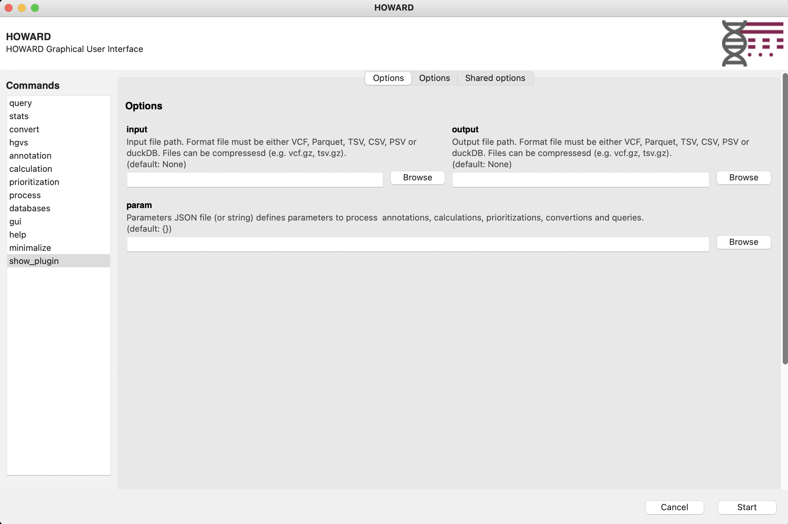
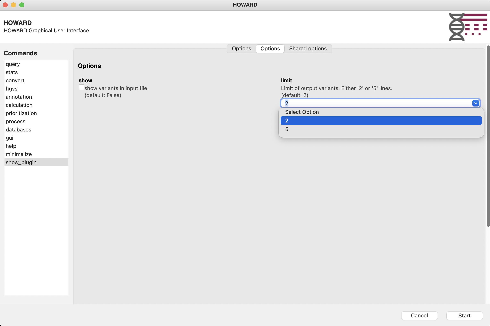

# HOWARD Plugins

HOWARD plugins are additional module that take advantage of HOWARD object and functions to manage input files.

## Plugins structure

Plugins are store in 'plugins' folder, and follow a specific structure:

```
plugins
|-- __init__.py
|-- plugin1
|   |-- README.md
|   |-- __init__.py
|   |-- __main__.py
|-- plugin2
    |-- README.md
    |-- __init__.py
    |-- __main__.py
```

### Plugins module init file

Mainly, plugins `__init__.py` file define enabled plugins, with variable `__all__`.

```ini
__all__ = ["plugin1", "plugin2"]
```

### Plugin init file

At least 2 files are needed. The `__init__.py` file defines the plugin with a description and a version, if the plugin is enabled (default `False`), and information about python code such as main file (default `__main__.py`) and main function (default(`main`)).

```
__description__ = "Plugin1 description"
__version__ = "1.0.0"
__enabled__ = True
__main_file__ = "__main__"
__main_function__ = "main"
```

### Plugin main file

Main plugin file (e.g. `__main__.py`) need to contain the main function (e.g. `main`), and also information about new arguments for this plugin (e.g. `show` and `limit`, see Python Argparse) and about command such as a description, help, examples and all avaiable arguments (e.g. existing `input` and `output` arguments).

## Example

> Example with 'show_plugin': files structure, init file, arguments, command, and main function

```
plugins
|-- __init__.py
|-- show_plugin
    |-- __init__.py
    |-- __main__.py
```

> Plugin is enable in main `plugins/__init__.py` file
```ini
__all__ = ["show_plugin"]
```

> Plugin is defined in `plugins/show_plugin/__init__.py` file
```ini
__description__ = "Show variants in an input file"
__version__ = "1.0.0"
__enabled__ = True
__main_file__ = "__main__"
__main_function__ = "main"

```

> Arguments, command, and main function in `plugins/show_plugin/__main__.py` file
```py
import argparse
import logging as log
from howard.objects.variants import Variants

# Arguments
arguments = {
    "show": {
        "help": """show variants in input file.\n""",
        "action": "store_true",
        "default": False,
    },
    "limit": {
        "help": """Limit of output variants.\n""" """Either '2' or '5' lines.\n""",
        "default": 2,
        "type": int,
        "choices": [2, 5],
    },
}

# Command
commands_arguments = {
    "show_plugin": {
        "function": "show_plugin",
        "description": """Show variants in an input file.\n""",
        "help": """Short description of the plugin1""",
        "epilog": """Usage examples:\n"""
        """   howard show_plugin --input=tests/data/example.vcf.gz --output=/tmp/example.minimal.vcf.gz  --show --limit=5 \n"""
        """   howard show_plugin --input=tests/data/example.vcf.gz --output=/tmp/example.minimal.tsv  --show \n"""
        """    \n""",
        "groups": {
            "main": {"input": True, "output": False, "param": False},
            "Options": {"show": False, "limit": False},
        },
    }
}

# Main function
def main(args: argparse) -> None:
    """
    Query input VCF file and show result
    """

    # Log
    log.info("START")

    # Debug
    log.debug(f"Input file: {args.input}")
    log.debug(f"Output file: {args.output}")

    # Load variants file
    variants_obj = Variants(input=args.input, output=args.output, load=True)

    # Create query and show results
    query = f"SELECT * FROM variants LIMIT {args.limit}"
    if args.show:
        df = variants_obj.get_query_to_df(query)
        log.info(df)

    # Export
    variants_obj.export_output(query=query, export_header=True)

    log.info("END")

```

## Help and GUI

Plugins will be available on Help command line and HOWARD GUI.

```bash
howard show_plugin --help
```
```
usage: howard show_plugin [-h] --input input [--output output] [--param param] [--show] [--limit {2,5}] [--config config] [--threads threads] [--memory memory] [--chunk_size chunk size] [--tmp Temporary folder]
                          [--duckdb_settings duckDB settings] [--verbosity verbosity] [--log log]

Show variants in an input file.

Options:
  -h, --help            show this help message and exit
  --input input         Input file path.
                        Format file must be either VCF, Parquet, TSV, CSV, PSV or duckDB.
                        Files can be compressesd (e.g. vcf.gz, tsv.gz).
                         (default: None)
  --output output       Output file path.
                        Format file must be either VCF, Parquet, TSV, CSV, PSV or duckDB.
                        Files can be compressesd (e.g. vcf.gz, tsv.gz).
                         (default: None)
  --param param         Parameters JSON file (or string) defines parameters to process
                        annotations, calculations, prioritizations, convertions and queries.
                         (default: {})

Options options:
  --show                show variants in input file.
                         (default: False)
  --limit {2,5}         Limit of output variants.
                        Either '2' or '5' lines.
                         (default: 2)

```

```bash
howard gui
```




